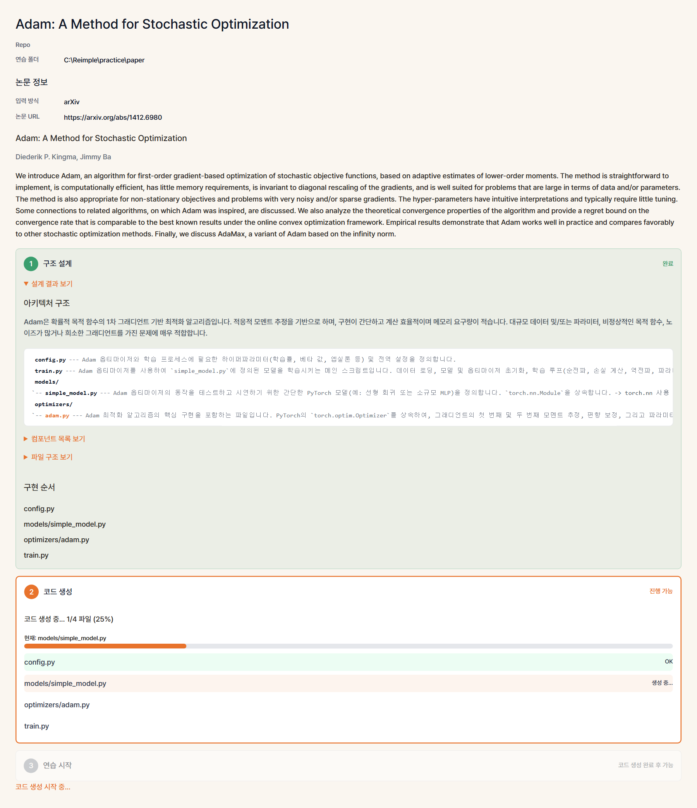
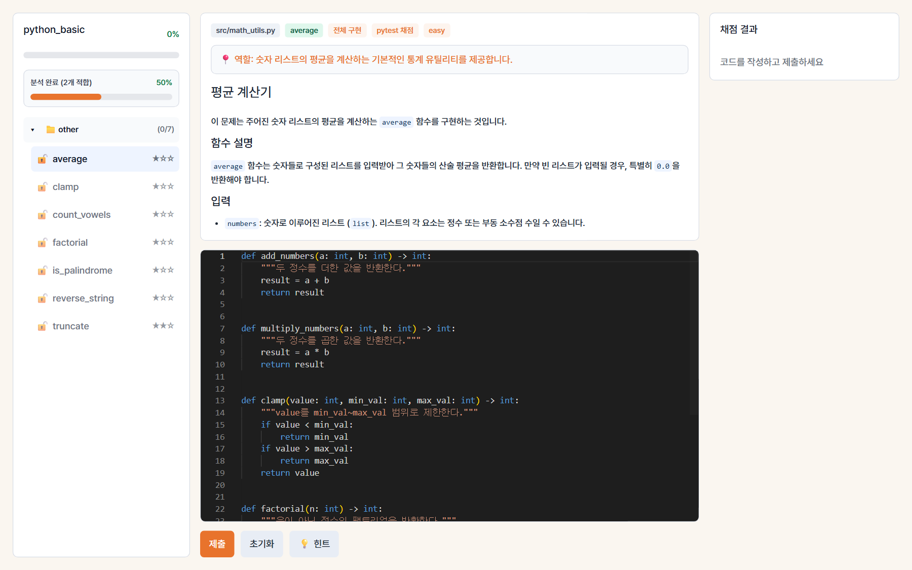
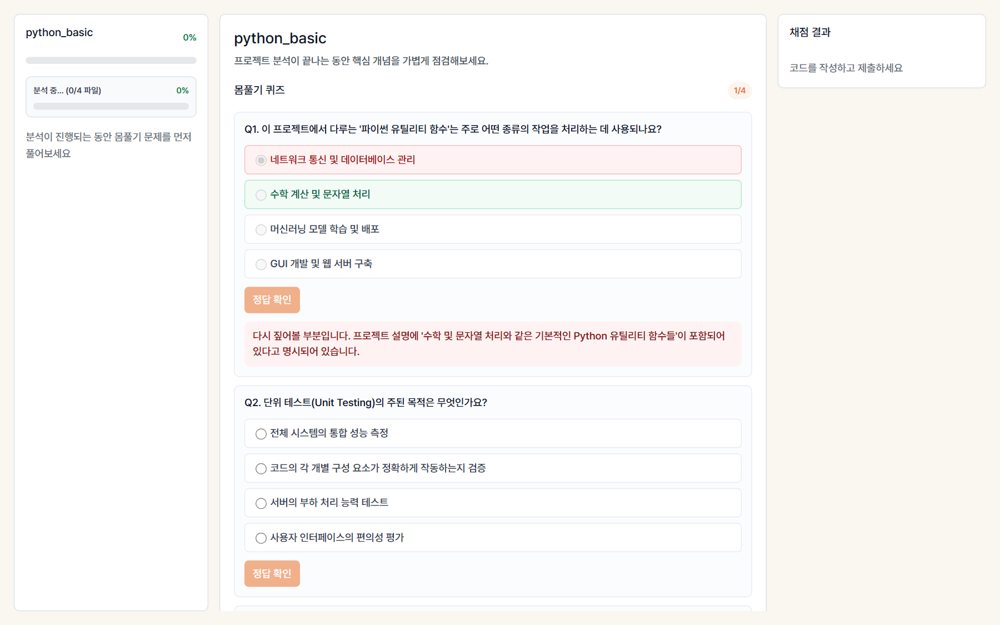

# Reimple
> a code called quest

AI 논문의 코드를 직접 재구현하면서 배우는 코딩 연습 도구.

GitHub repo 또는 arXiv 논문을 입력하면 프로젝트를 자동 분석하고,
핵심 함수를 빈칸으로 만들어 단계별 코딩 문제를 생성합니다.
기초 모듈부터 고급 모듈 순서로 해금되며,
전체 프로젝트를 하나씩 완성해 나가는 방식으로 학습합니다.

- **코드 기반**: GitHub repo → 구조 분석 → 함수 단위 문제 생성
- **논문 기반**: arXiv/PDF → Paper2Code 방식으로 참조 코드 생성 → 문제 생성
- **AI 채점**: pytest 또는 LLM 기반 코드 비교 채점
- **단계별 학습**: PaperBench 영감의 문제 트리 + 의존 관계 해금

---

## 핵심 기능

### Repo 분석 → 문제 생성 → 풀기 → 저장

로컬 repo를 불러오면 Python 파일을 분석해 함수 빈칸 채우기 문제를 자동 생성합니다. 풀고, pytest를 통과하면, 파일이 저장됩니다.


---

### Repo 분석

로컬 repo 경로를 입력하면 파일 트리와 확장자 통계를 분석하고, 문제로 만들 수 있는 파일을 식별합니다.

- 파일 트리와 확장자별 파일 수 표시
- 테스트 파일 자동 매칭 (`tests/test_*.py`)
- `.git`, `__pycache__`, `.venv` 등 제외


---

### 문제 생성

Python AST로 각 `.py` 파일을 분석해 문제로 적합한 함수를 선별하고, Gemini로 문제 설명과 starter code를 생성합니다.

- type hint, docstring, return 문 기반으로 최적 함수 선택 (AST)
- LLM으로 문제 설명·starter code 생성 (키 없으면 기본 템플릿 fallback)
- 선택된 함수 body만 `raise NotImplementedError`로 교체
- 나머지 함수, 클래스, import는 원본 그대로 유지
- 문제 생성 전 원본 repo의 pytest 통과 여부 검증


---

### 코드 에디터 + pytest 채점

Monaco Editor에서 함수를 구현하고 제출하면, 매칭된 테스트 파일을 격리된 임시 디렉토리에서 실행해 채점합니다.

- Python 문법 하이라이팅 (Monaco Editor)
- repo에 이미 있는 pytest 테스트로 채점
- 실패 시 stdout / stderr 표시
- 통과 시 연습 폴더에 파일 저장


---

### 연습 폴더

통과한 파일은 원본 repo 구조 그대로 연습 폴더에 저장됩니다. 설정 파일, README 등 비대상 파일은 setup 단계에서 자동 복사되어 프로젝트가 바로 실행 가능한 상태를 유지합니다.

```
practice_root/
├── README.md          ← 자동 복사
├── pyproject.toml     ← 자동 복사
└── src/
    └── math_utils.py  ← 통과 후 저장
```

---

### 논문 기반 모드

arXiv URL 또는 PDF를 입력하면 Paper2Code 방식으로 논문을 분석하고, 참조 코드를 자동 생성한 뒤, 그 코드로 연습 문제를 만듭니다.

**Step 1. 구조 설계** — 논문에서 핵심 컴포넌트를 추출하고 파일 구조와 구현 순서를 설계합니다.

- 핵심 컴포넌트 추출 (Attention, Embedding, Backbone 등)
- 파일 구조 + 클래스/함수 설계
- 의존성 기반 구현 순서 결정

**Step 2. 코드 생성** — 설계를 기반으로 의존 순서대로 파일을 하나씩 생성합니다. 각 파일은 이전에 생성된 파일을 참조하여 import 일관성을 유지합니다.

**Step 3. 연습** — 생성된 코드가 repo처럼 동작하여 코드 기반 모드와 동일한 흐름으로 연습합니다.



---

### 문제 트리 + 해금

PaperBench에서 영감을 받은 계층적 문제 구조. 기초 모듈을 풀어야 상위 모듈이 해금됩니다.

- 모듈별 문제 그룹 (model / training / data)
- 🔓 풀 수 있는 문제 / 🔒 잠긴 문제 / ✅ 완료된 문제
- 전체 진행도 + 모듈별 진행도



---

### LLM 채점 + 힌트

pytest가 없는 프로젝트에서는 LLM이 원본 코드와 비교하여 채점합니다. 막히면 3단계 힌트를 제공합니다.

- **pytest 채점**: 테스트 파일이 있으면 격리 환경에서 실행
- **LLM 채점**: 테스트가 없으면 원본 코드와 비교 판정
- **힌트**: 레벨 1 (개념) → 레벨 2 (입출력) → 레벨 3 (알고리즘 방향)

---

### 몸풀기 퀴즈

프로젝트 분석이 진행되는 동안 논문/프로젝트 관련 객관식 퀴즈로 배경 지식을 점검합니다.



---

## 시작하기

### 사전 준비

- Python 3.10+
- Node.js 18+

### 빠른 시작 (권장)

```bash
git clone https://github.com/kyw948/Reimple.git
cd Reimple
```

**Windows**
```powershell
./start.ps1
```

**Mac / Linux**
```bash
chmod +x start.sh
./start.sh
```

첫 실행 시 Gemini API 키 입력을 요청합니다.
[Google AI Studio](https://aistudio.google.com/apikey)에서 무료 발급 가능.

브라우저에서 http://localhost:5173 접속.

### 수동 설치

```bash
cd backend
python -m venv .venv
source .venv/bin/activate   # Windows: .venv\Scripts\activate
pip install -r requirements.txt
echo "GEMINI_API_KEY=your_key" > .env

cd ../frontend
npm install
```

### 수동 실행

```bash
# 터미널 1 — 백엔드
cd backend
source .venv/bin/activate
uvicorn app.main:app --reload --port 8000

# 터미널 2 — 프론트엔드
cd frontend
npm run dev
```

브라우저에서 http://localhost:5173 을 엽니다.

---

## 프로젝트 구조

```
Reimple/
├── backend/
│   └── app/
│       ├── main.py                    # FastAPI 엔트리
│       ├── core/                      # 설정, 에러
│       ├── db/                        # SQLite
│       └── services/
│           ├── project_analyzer.py    # 프로젝트 분석 (Step 1~3)
│           ├── file_assessor.py       # 파일 적합성 분석
│           ├── problem_generator.py   # 문제 생성
│           ├── problem_tree.py        # 문제 트리 + 해금
│           ├── paper_parser.py        # 논문 PDF 파싱
│           ├── paper_planner.py       # Paper2Code Planning
│           ├── paper_codegen.py       # Paper2Code Coding
│           ├── llm_client.py          # Gemini API
│           ├── llm_grader.py          # LLM 채점
│           ├── runner.py              # pytest 실행
│           ├── warmup_generator.py    # 몸풀기 퀴즈
│           └── hint_generator.py      # 힌트 생성
├── frontend/
│   └── src/
│       ├── pages/
│       │   ├── SetupPage.tsx          # 입력 (Git / 논문)
│       │   ├── AnalyzePage.tsx        # 분석 결과 + 구조 설계
│       │   └── PracticePage.tsx       # 에디터 + 채점
│       └── stores/                    # Zustand 상태
├── docs/                              # 설계 문서
├── samples/                           # 테스트용 샘플 repo
├── start.ps1                          # Windows 실행
└── start.sh                           # Mac/Linux 실행
```

---

## 채점 규칙

| 조건 | 결과 |
|------|------|
| 매칭된 테스트 전체 통과 | ✅ 연습 폴더에 저장 |
| 테스트 실패 | ❌ 저장 안 함, stderr 표시 |
| 테스트 없음 (LLM 채점) | LLM이 원본 코드와 비교 판정 |
| 문법 / import 오류 | ❌ 저장 안 함, 오류 표시 |
| 타임아웃 (30초 초과) | ❌ 저장 안 함, 타임아웃 표시 |
| 파일 이미 존재, `overwrite=false` | ⚠️ 통과했지만 덮어쓰지 않음 |

---

## 참고 논문

- [Paper2Code](https://github.com/going-doer/Paper2Code) (ICLR 2026) — 논문→코드 변환 파이프라인. 코드 모드에서 역방향, 논문 모드에서 정방향 적용.
- [PaperBench](https://github.com/openai/preparedness-paper-bench) (OpenAI, 2025) — 계층적 rubric 구조. 문제 트리, 가중치, 해금 시스템에 적용.

---

## 라이선스

MIT License

---

## 크레딧

- [Monaco Editor](https://microsoft.github.io/monaco-editor/) — 코드 에디터
- [pytest](https://pytest.org/) — 테스트 실행 및 채점
- [Google Gemini](https://ai.google.dev/) — LLM
- *A Tribe Called Quest*
- Paper2Code (https://github.com/going-doer/paper2code, https://arxiv.org/abs/2504.17192)
