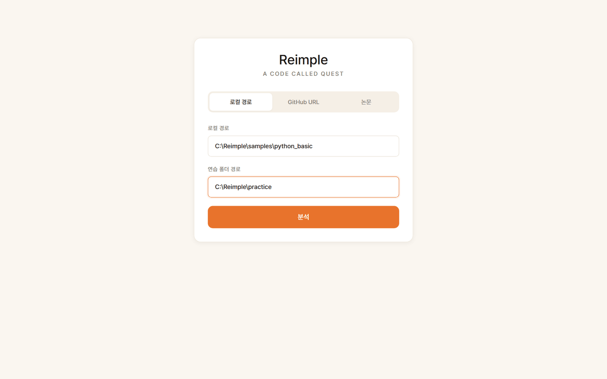
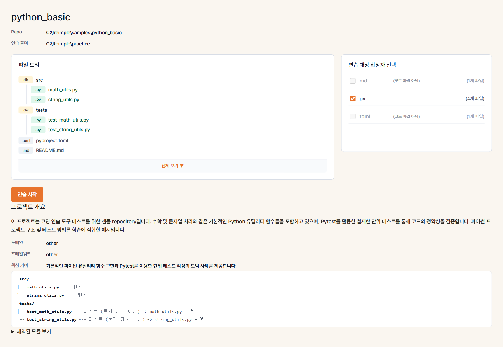
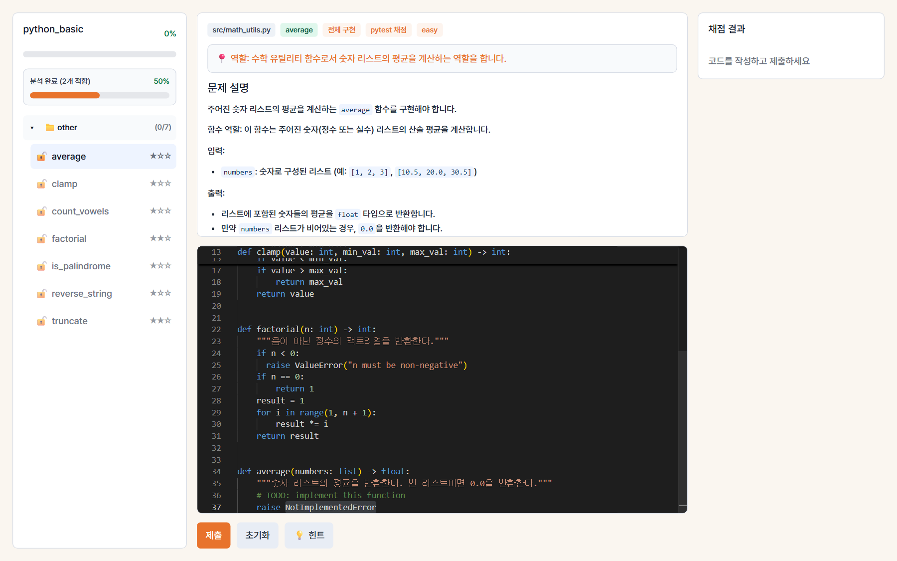
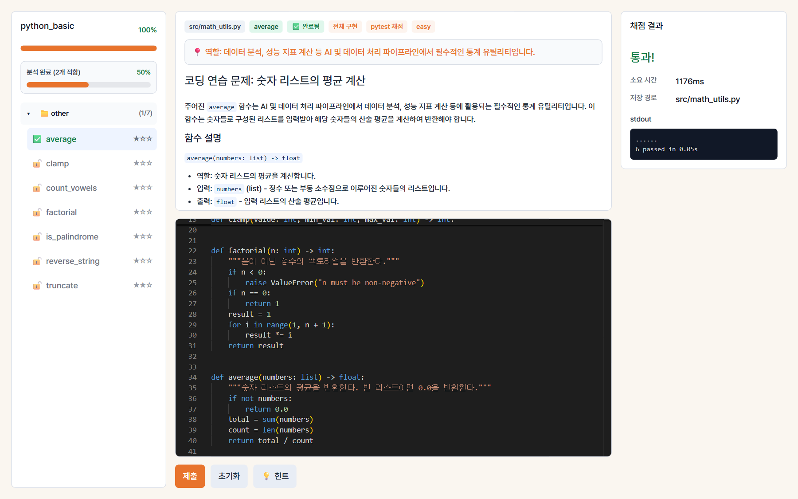

# Reimple
> a code called quest

AI 논문의 코드를 직접 재구현하면서 배우는 코딩 연습 도구.

GitHub repo 또는 arXiv 논문을 입력하면 프로젝트를 자동 분석하고,
핵심 함수를 빈칸으로 만들어 단계별 코딩 문제를 생성합니다.
기초 모듈부터 고급 모듈 순서로 해금되며,
전체 프로젝트를 하나씩 완성해 나가는 방식으로 학습합니다.

- **코드 기반**: GitHub repo → 구조 분석 → 함수 단위 문제 생성
- **논문 기반**: arXiv/PDF → Paper2Code 방식으로 참조 코드 생성 → 문제 생성
- **AI 채점**: pytest 또는 LLM 기반 코드 비교 채점
- **단계별 학습**: PaperBench 영감의 문제 트리 + 의존 관계 해금
---

## 핵심 기능

### Repo 분석 → 문제 생성 → 풀기 → 저장

로컬 repo를 불러오면 Python 파일을 분석해 함수 빈칸 채우기 문제를 자동 생성합니다. 풀고, pytest를 통과하면, 파일이 저장됩니다.



---

### Repo 분석

로컬 repo 경로를 입력하면 파일 트리와 확장자 통계를 분석하고, 문제로 만들 수 있는 파일을 식별합니다.

- 파일 트리와 확장자별 파일 수 표시
- 테스트 파일 자동 매칭 (`tests/test_*.py`)
- `.git`, `__pycache__`, `.venv` 등 제외



---

### 문제 생성

Python AST로 각 `.py` 파일을 분석해 문제로 적합한 함수를 선별하고, Gemini로 문제 설명과 starter code를 생성합니다.

- type hint, docstring, return 문 기반으로 최적 함수 선택 (AST)
- LLM으로 문제 설명·starter code 생성 (키 없으면 기본 템플릿 fallback)
- 선택된 함수 body만 `raise NotImplementedError`로 교체
- 나머지 함수, 클래스, import는 원본 그대로 유지
- 문제 생성 전 원본 repo의 pytest 통과 여부 검증



---

### 코드 에디터 + pytest 채점

Monaco Editor에서 함수를 구현하고 제출하면, 매칭된 테스트 파일을 격리된 임시 디렉토리에서 실행해 채점합니다.

- Python 문법 하이라이팅 (Monaco Editor)
- repo에 이미 있는 pytest 테스트로 채점
- 실패 시 stdout / stderr 표시
- 통과 시 연습 폴더에 파일 저장



---

### 연습 폴더

통과한 파일은 원본 repo 구조 그대로 연습 폴더에 저장됩니다. 설정 파일, README 등 비대상 파일은 setup 단계에서 자동 복사되어 프로젝트가 바로 실행 가능한 상태를 유지합니다.

```
practice_root/
├── README.md          ← 자동 복사
├── pyproject.toml     ← 자동 복사
└── src/
    └── math_utils.py  ← 통과 후 저장
```

---

## 시작하기

### 사전 준비

- Python 3.11+
- Node.js 18+

### 설치

```bash
git clone https://github.com/kyw948/Reimple.git
cd Reimple

cd backend
python -m venv .venv
source .venv/bin/activate   # Windows: .venv\Scripts\activate
pip install -r requirements.txt

cd ../frontend
npm install
```

### 환경 변수

`backend/.env.example`을 복사해 `backend/.env`를 만들고 값을 채웁니다.

```bash
cd backend
cp .env.example .env   # Windows: copy .env.example .env
```

`GEMINI_API_KEY`는 [Google AI Studio](https://aistudio.google.com/apikey)에서 발급합니다.  
프로젝트 분석, 문제 생성, 힌트, LLM 채점, 논문 모드에 필요합니다.

```env
DATABASE_URL=sqlite:///./app.db
SYNTAX_TIMEOUT_SECONDS=5
RUNNER_TEST_TIMEOUT_SECONDS=10
RUNNER_SUBMIT_TIMEOUT_SECONDS=30
FRONTEND_ORIGIN=http://localhost:5173
GEMINI_API_KEY=your-gemini-api-key-here
```

> **주의:** `backend/.env`는 git에 올리지 마세요. API 키가 포함됩니다.

### 실행

```bash
# 터미널 1 — 백엔드
cd backend
uvicorn app.main:app --reload --port 8000

# 터미널 2 — 프론트엔드
cd frontend
npm run dev
```

브라우저에서 http://localhost:5173 을 엽니다.

---

## 프로젝트 구조

```
quest/
├── backend/
│   └── app/
│       ├── main.py                   # FastAPI 엔트리
│       ├── api/                      # 라우트 핸들러
│       ├── core/                     # 설정, 에러
│       ├── db/                       # SQLite 모델
│       └── services/
│           ├── repo_analyzer.py      # 파일 트리 + 확장자 통계
│           ├── problem_generator.py  # AST 분석 + 문제 생성
│           ├── test_matcher.py       # 테스트 파일 매칭
│           ├── runner.py             # pytest 실행 + 채점
│           └── file_manager.py      # 연습 폴더 파일 관리
├── frontend/
│   └── src/
│       ├── pages/
│       │   ├── SetupPage.tsx         # Repo 경로 입력
│       │   ├── AnalyzePage.tsx       # 파일 트리 + 문제 생성
│       │   └── PracticePage.tsx      # 에디터 + 채점
│       ├── components/               # UI 컴포넌트
│       ├── stores/                   # Zustand 상태
│       └── api/                      # API 클라이언트
└── samples/
    └── python_basic/                 # 테스트용 샘플 repo
```

---

## 채점 규칙

| 조건 | 결과 |
|------|------|
| 매칭된 테스트 전체 통과 | ✅ 연습 폴더에 저장 |
| 테스트 실패 | ❌ 저장 안 함, stderr 표시 |
| 문법 / import 오류 | ❌ 저장 안 함, 오류 표시 |
| 타임아웃 (30초 초과) | ❌ 저장 안 함, 타임아웃 표시 |
| 파일 이미 존재, `overwrite=false` | ⚠️ 통과했지만 덮어쓰지 않음 |

---

## 라이선스

MIT License

---

## 크레딧

- [Monaco Editor](https://microsoft.github.io/monaco-editor/) — 코드 에디터
- [pytest](https://pytest.org/) — 테스트 실행 및 채점
- *A Tribe Called Quest*
- Paper2Code (https://github.com/going-doer/paper2code, https://arxiv.org/abs/2504.17192)
